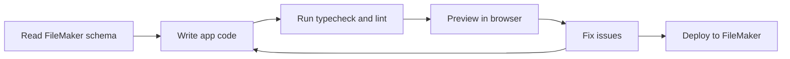

import { Callout } from "fumadocs-ui/components/callout";

ProofKit is designed for agents that can do more than produce snippets. The workflow gives the agent real FileMaker context, a project it can edit, and feedback it can use to fix mistakes.

## The loop

## What each step needs

- **Read FileMaker schema**: the MCP server exposes file metadata and data context to the agent.
- **Write app code**: the agent edits a normal web project using React, TypeScript, Tailwind, and shadcn/ui.
- **Run checks**: TypeGen and TypeScript catch many schema and field-name mistakes before runtime.
- **Preview in browser**: the agent can inspect the app as it runs, not just reason about code.
- **Fix issues**: errors, screenshots, and build output become feedback for the next edit.
- **Deploy to FileMaker**: the final bundle is pushed into the file and loaded by the WebViewer.

<Callout title="TODO: Diagram - Agent workflow">
  Replace or polish the Mermaid diagram with the final agent workflow visual if a branded SVG or React component is created.
</Callout>

## Why this matters

Without the loop, you are usually copying FileMaker metadata into a chat, pasting code back into a project, discovering errors manually, and asking the model to try again. ProofKit gives the agent enough context and feedback to handle more of that cycle directly.

## Boundaries

ProofKit v2 focuses on agentic coding of WebViewer apps. It does not make the agent a full FileMaker schema editor. Scripts, tables, fields, layouts, and value lists remain outside the supported writing scope for this release.

## Related pages

- [Install and Connect](/docs/ai/install-and-connect)
- [Build a WebViewer App](/docs/ai/build-a-webviewer-app)
- [Hybrid App Architecture](/docs/hybrid-apps/architecture)
