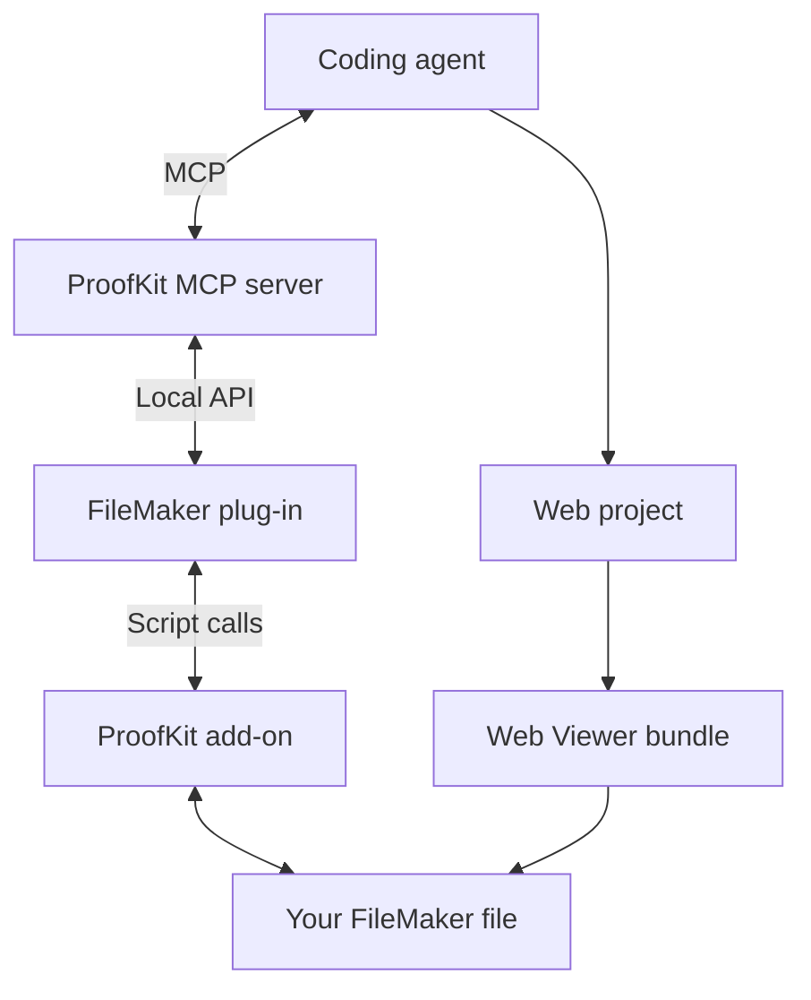
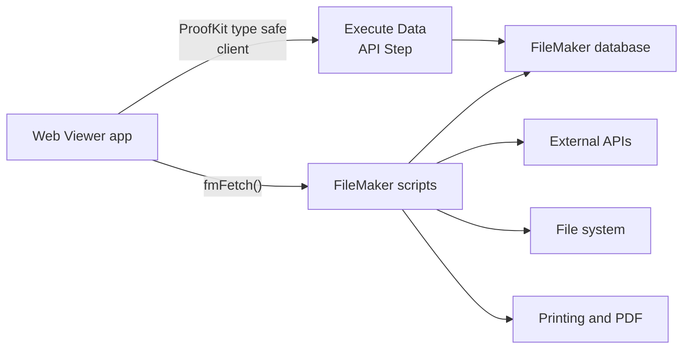

import { Callout } from "fumadocs-ui/components/callout";

ProofKit has two related architectures: the development loop that lets an agent build the app, and the runtime loop that lets the deployed Web Viewer app talk to FileMaker.

## Development architecture

<Callout title="Connection labels">
  - **MCP**: Model Context Protocol, the tool protocol the coding agent uses to talk to the ProofKit MCP server.
  - **Local API**: The local bridge between the ProofKit MCP server and the FileMaker plug-in.
  - **Script calls**: FileMaker script execution used by the plug-in and add-on to work with your FileMaker file.
</Callout>

## Runtime architecture

<Callout title="Connection labels">
  - **ProofKit type safe client**: Generated client code that calls FileMaker's Data API through the Execute Data API script step.
  - **fmFetch()**: A lightweight script bridge for calling FileMaker scripts from the Web Viewer app.
</Callout>

## How to think about it

- During development, the agent uses ProofKit tools to understand the FileMaker file and deploy bundles.
- At runtime, the deployed web app talks to FileMaker through fmFetch scripts and the type-safe Data API path.
- FileMaker scripts remain the secure place for privileged operations, external API secrets, filesystem work, and print/PDF flows.

## Related pages

- [Agent Workflow](/docs/ai/agent-workflow)
- [Runtime Under the Hood](/docs/webviewer/runtime-under-the-hood)
- [FileMaker Scripts as Backend](/docs/webviewer/filemaker-scripts-as-backend)
