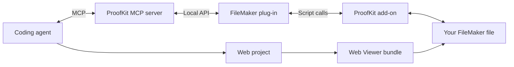
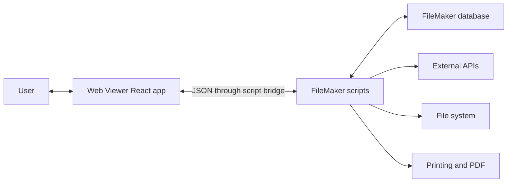

import { Callout } from "fumadocs-ui/components/callout";

ProofKit has two related architectures: the development loop that lets an agent build the app, and the runtime loop that lets the deployed Web Viewer app talk to FileMaker.

## Development architecture

<Callout title="TODO: Diagram - Development architecture">
  Replace or polish this Mermaid diagram with the final branded architecture visual if needed.
</Callout>

## Runtime architecture

<Callout title="TODO: Diagram - Runtime architecture">
  Replace or polish this Mermaid diagram with the final runtime/data-flow visual.
</Callout>

## How to think about it

- During development, the agent uses ProofKit tools to understand the FileMaker file and deploy bundles.
- At runtime, the deployed web app talks to FileMaker scripts through the Web Viewer bridge.
- FileMaker scripts remain the secure place for privileged operations, external API secrets, filesystem work, and print/PDF flows.

## Related pages

- [Agent Workflow](/docs/ai/agent-workflow)
- [Runtime Under the Hood](/docs/webviewer/runtime-under-the-hood)
- [FileMaker Scripts as Backend](/docs/webviewer/filemaker-scripts-as-backend)
