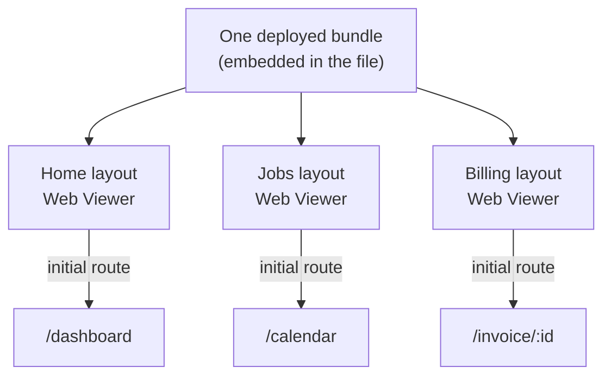

import { Callout } from "fumadocs-ui/components/callout";

You have a dashboard chart for the Home layout, a scheduling calendar for the Jobs layout, and an invoice editor for the Billing layout. The FileMaker instinct is to build three separate apps, one per widget.

Build one app instead. Point every Web Viewer at the same bundle and tell each one which screen to open.

<Callout type="info">
  This page assumes the [embedded deployment method](/docs/webviewer/deployment-methods), where the Web Viewer code lives in your FileMaker file.
</Callout>

## The rule: one app per FileMaker file

Default to **one ProofKit app per FileMaker file**. Every screen you want in a Web Viewer &mdash; every "widget" &mdash; is a route inside that one app, not a project of its own.

This matches how you already work. You keep every layout in one FileMaker file; keep every web screen in one web app. The embedded code lives in the file, so the app and the file share the same boundary.

## Why one app

- **One build, one deploy, one update.** Change a shared component or upgrade a dependency once, and every screen gets it. Separate apps mean separate projects, separate embed fields, and separate deploys to keep in sync by hand.
- **Consistent look and behavior.** A shared component library keeps the calendar, the dashboard, and the editor looking like one product. Separate apps drift apart.
- **Set up the plumbing once.** The [initial props](/docs/webviewer/initial-props) handshake, the user context, the generated data client and types, and the TanStack Query config get configured a single time and reused on every screen.
- **Screens can link to each other.** The dashboard can navigate to the invoice editor because they share a router. Crossing between separate apps means reloading a different bundle.

## How it loads: one bundle, many entry points

Each Web Viewer object loads its own copy of the bundle. There is no shared memory between them &mdash; a Web Viewer on the Home layout and one on the Jobs layout are independent instances of the same app.

What differs is where each instance starts. When a Web Viewer loads, it asks FileMaker for its [initial props](/docs/webviewer/initial-props), and the reply includes a starting route. The Home layout's Web Viewer opens to `/dashboard`, the Jobs layout's opens to `/calendar`, the Billing layout's opens to `/invoice/:id`.

Each Web Viewer still feels like a single-purpose widget on its layout. Underneath, all three are the same app opened to a different route. See [Initial Props](/docs/webviewer/initial-props) for the code that reads the starting route and hands it to the router.

The entry point is a property of **where the widget lives**, not of the current record. The Jobs layout's Web Viewer always opens the calendar. If you also need to route by record context &mdash; open a specific customer, jump to a selected portal row &mdash; the same initial-props script decides that too.

## One screen or many

A single Web Viewer can also host the whole app and let the user navigate between screens inside it, with a nav sidebar and in-app routing. FileMaker becomes the shell, and the app behaves like a normal single-page app.

Both patterns use the same bundle. Use a deep-linked Web Viewer per layout when each screen belongs to its own FileMaker context; use one full-app Web Viewer when the user should move between screens without leaving the layout.

## When a separate app is justified

Splitting into a second app is rare. Two cases justify it:

- **A measured loading problem.** Embedded Web Viewer apps ship as one bundle, but conventional public-site page-weight budgets don't directly apply. A bundle of a few megabytes isn't inherently too large for FileMaker or WebDirect. Keep screens together unless testing on your target FileMaker clients shows that a unique dependency materially slows startup. If it does, removing that dependency or moving its screen into a separate app can reduce the shared bundle.
- **An independent release cadence.** A screen that ships on its own schedule, or is owned by a different team, can warrant its own project so its deploys don't touch the shared app.

Outside these cases, add the screen as a route.

## Related

- [Initial Props](/docs/webviewer/initial-props) &mdash; read the starting route and hand it to the router.
- [Deployment Methods](/docs/webviewer/deployment-methods) &mdash; how the embedded bundle gets into the file.
- [Architecture](/docs/webviewer/architecture) &mdash; how the Web Viewer, scripts, and data connect.
