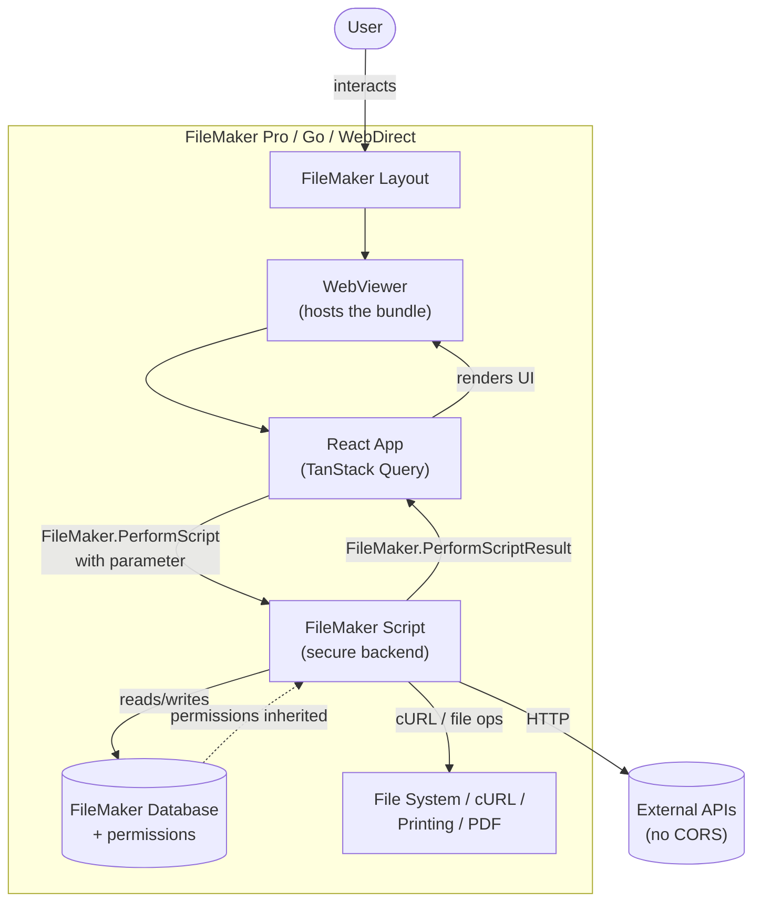

# Data Flow

This document explains how data moves between FileMaker and a ProofKit WebViewer app at runtime. It's a companion to [Hybrid Apps](hyrid-apps.md) — that document explains *why* the hybrid model is powerful, this one explains *how* the pieces fit together.

> **Note:** The diagram below is a working draft. The shape is right, but the specific call names and flows may need refinement.

## The Round Trip

A ProofKit WebViewer app is a normal React app that happens to run inside a FileMaker WebViewer. The WebViewer hosts the HTML/JS bundle; the React app talks to FileMaker by calling FileMaker scripts and receiving structured data back.

## The Pieces

- **The user** interacts with a FileMaker layout that contains a WebViewer.
- **The WebViewer** hosts the bundled HTML/JS — the React app deployed by ProofKit.
- **The React app** uses TanStack Query to manage server state and trigger calls to FileMaker.
- **FileMaker scripts** are the secure back end. Anything the script can do, the web app can now do — read/write the database, make CORS-free network requests, access the file system, generate PDFs.
- **The database** enforces the user's privilege set. The script runs with the user's permissions, so authorization is inherited rather than re-implemented.

## Why This Matters

Two properties fall out of this architecture:

1. **Secrets stay in FileMaker.** API keys, credentials, and sensitive logic live inside scripts. Browser code never sees them.
2. **The web app inherits everything FileMaker can do.** Printing, file system access, native cURL, plugins — all reachable through a script call.

For deeper coverage of these advantages, see [Hybrid Apps — Advantages Over Browser-Only Apps](hyrid-apps.md#advantages-over-browser-only-apps).
