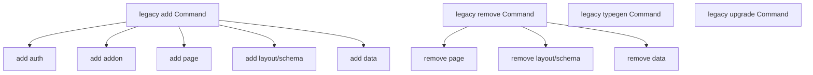

# ProofKit CLI Flow Audit

## Actual runtime flow

```mermaid
flowchart TD
  A[proofkit] --> B{explicit subcommand?}

  B -->|no| C{proofkit.json in cwd?}
  C -->|yes| D[print project guidance<br/>doctor / prompt / init]
  C -->|no + interactive| E[run init]
  C -->|no + non-interactive| F[fail: explicit command required]

  B -->|init| G[Effect init flow]
  G --> G1[resolve request]
  G1 --> G2[plan init]
  G2 --> G3[execute init plan]

  B -->|doctor| H[doctor audit]
  B -->|prompt| I[placeholder note only]

  B -->|add| J{arg `name` present?}
  J -->|addon| J1[add addon target]
  J -->|tanstack-query| J2[run tanstack-query installer]
  J -->|any other name| J3[installFromRegistry(name)]
  J -->|no| J4{proofkit.json readable?}
  J4 -->|no| J5[preflight add]
  J5 --> J6[registry-driven add flow]
  J4 -->|yes + ui=shadcn| J6
  J4 -->|yes + ui!=shadcn| J7[legacy interactive add menu]
  J7 -->|page| J8[runAddPageAction]
  J7 -->|schema| J9[runAddSchemaAction]
  J7 -->|data| J10[runAddDataSourceCommand]
  J7 -->|react-email| J11[runAddReactEmailCommand]
  J7 -->|auth| J12[runAddAuthAction]

  B -->|remove| K[legacy interactive remove menu]
  K -->|page| K1[runRemovePageAction]
  K -->|schema| K2[runRemoveSchemaAction]
  K -->|data| K3[runRemoveDataSourceCommand]

  B -->|typegen| L[legacy alias -> runCodegenCommand]
  B -->|deploy| M[legacy deploy flow]
  B -->|upgrade| N[legacy upgrade flow]
```

## Stranded legacy branches

These paths still exist in legacy Commander modules, but new root routing does not expose them as subcommands:



The new root CLI only exposes flat `add [name] [target]` and `remove [name]`, so those nested branches are currently implementation-only.

## Gaps / dead ends

1. `add` positional names misroute.
   `runAdd()` special-cases only `addon` and `tanstack-query`, then sends every other provided `name` to `installFromRegistry(name)`. That means `proofkit add auth`, `proofkit add page`, `proofkit add schema`, `proofkit add layout`, `proofkit add data`, and `proofkit add react-email` do not hit their legacy handlers. They go to registry install instead.

2. `remove [name]` is dead input.
   `runRemove()` ignores `_name` entirely and always opens the interactive picker. So `proofkit remove page` does not remove a page directly. In non-interactive mode, this path has no direct branch and is likely unusable.

3. Legacy subcommands still defined, but unreachable from root parser.
   The root Effect CLI exposes `add` and `remove` as flat commands only. The nested Commander subcommands still exist under legacy `makeAddCommand()` and `makeRemoveCommand()`, but root help and parsing never surface `add auth`, `add page`, `remove page`, etc as true subcommands.

4. `prompt` is a deliberate stub.
   `proofkit prompt` exits successfully, but only prints a "coming soon" note. It is a real command but still a product dead end.

5. Docs and runtime surface diverge.
   Docs describe ProofKit as mainly `init`, `doctor`, and `prompt`, with package-native CLIs for ongoing work. Runtime still advertises `add`, `remove`, `typegen`, `deploy`, and `upgrade`.

6. Naming drift: `schema` vs `layout`.
   Legacy schema add/remove commands are actually named `layout` with alias `schema`. Interactive menus say "Schema". If nested subcommands come back, this naming split will still be confusing.

## Tight fix list

1. Pick one surface: flat verbs or nested subcommands.
2. If flat:
   Make `runAdd(name)` dispatch explicit names to real handlers before registry fallback.
3. If flat:
   Make `runRemove(name)` honor `page|schema|data`.
4. If nested:
   Rebuild `add` and `remove` as Effect subcommand trees instead of flat arg parsers.
5. Hide or remove legacy commands still meant to be package-native only.
6. Either implement `prompt` or mark it hidden until ready.

## Source refs

- Root command surface: [packages/cli/src/index.ts](/Users/ericluce/Documents/Code/work/proofkit/packages/cli/src/index.ts:206)
- Root subcommand list: [packages/cli/src/index.ts](/Users/ericluce/Documents/Code/work/proofkit/packages/cli/src/index.ts:402)
- `add` dispatch: [packages/cli/src/cli/add/index.ts](/Users/ericluce/Documents/Code/work/proofkit/packages/cli/src/cli/add/index.ts:102)
- Stranded legacy `add` subcommands: [packages/cli/src/cli/add/index.ts](/Users/ericluce/Documents/Code/work/proofkit/packages/cli/src/cli/add/index.ts:166)
- `remove` ignoring arg: [packages/cli/src/cli/remove/index.ts](/Users/ericluce/Documents/Code/work/proofkit/packages/cli/src/cli/remove/index.ts:12)
- Stranded legacy `remove` subcommands: [packages/cli/src/cli/remove/index.ts](/Users/ericluce/Documents/Code/work/proofkit/packages/cli/src/cli/remove/index.ts:47)
- `layout` alias naming: [packages/cli/src/cli/add/fmschema.ts](/Users/ericluce/Documents/Code/work/proofkit/packages/cli/src/cli/add/fmschema.ts:193)
- `prompt` stub: [packages/cli/src/core/prompt.ts](/Users/ericluce/Documents/Code/work/proofkit/packages/cli/src/core/prompt.ts:5)
- Docs surface: [apps/docs/content/docs/cli/reference/cli-commands.mdx](/Users/ericluce/Documents/Code/work/proofkit/apps/docs/content/docs/cli/reference/cli-commands.mdx:12)
